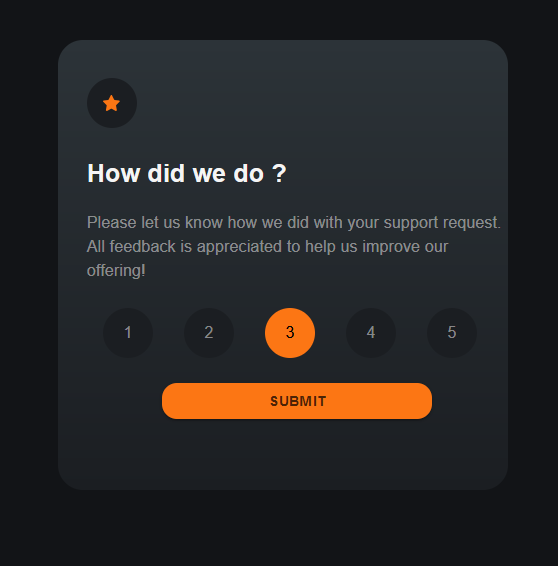
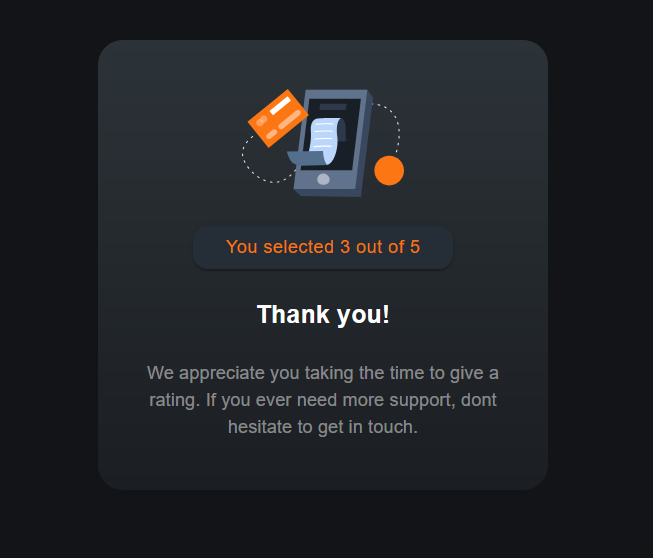

# Rating App

A web application that allows users to provide feedback by rating. The app is built with **Next.js** and is deployed on **Vercel**.

## Features

- Users can select ratings from a scale (e.g., 1-5).
- Dynamic hover effects and highlighted selection.
- Fully responsive design for desktop and mobile.
- Seamlessly hosted on Vercel for fast and reliable access.

## Live Demo

The app is live and accessible at: https://rating-teal.vercel.app/

## Getting Started

### Prerequisites

Ensure you have the following installed on your system:

- **Node.js** (version 14 or higher)
- **npm** (comes with Node.js)

### Installation and Setup

Follow the steps below to run the app locally:

1. **Clone the Repository**  
   Open your terminal and run:

   git clone https://github.com/Saikiruthiga/Rating

2.**Navigate to the app folder**
cd my-app/app

3.**Install dependencies**
npm install

4.**Run the development server**
npm run dev

5.**Access the app**
Open your browser and visit http://localhost:3000

Technologies Used

    Next.js: Framework for server-rendered React applications.
    Vercel: Hosting and deployment.
    CSS: Styling for hover effects and responsive design.
    Material-UI (Optional): For reusable and accessible UI components.

Screenshots:

